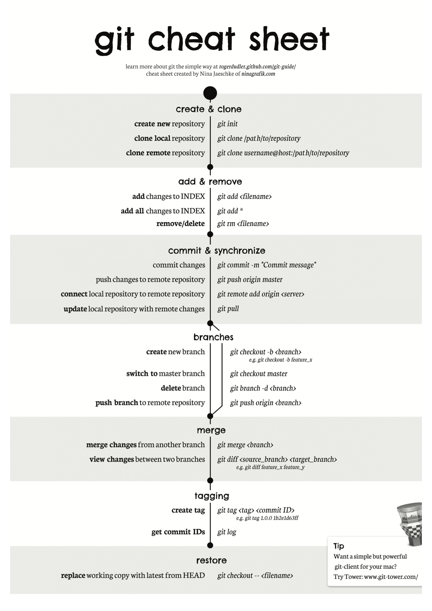

[TOC]


Table of Contents
=================

      * [Useful commands](#useful-commands)
         * [Overview](#overview)
         * [Create Repo](#create-repo)
         * [Branches](#branches)
               * [New branch](#new-branch)
               * [Switch branches](#switch-branches)
               * [Delete branch](#delete-branch)
         * [Merging](#merging)
         * [Remote repo](#remote-repo)
               * [Add remote](#add-remote)
               * [pull](#pull)
         * [Misc](#misc)
            * [diff](#diff)
            * [log](#log)
            * [undo things](#undo-things)
               * [Revert a file to the state of head](#revert-a-file-to-the-state-of-head)
               * [Revert project to the state of remote](#revert-project-to-the-state-of-remote)
               * [Download single file from a github repository](#download-single-file-from-a-github-repository)
      * [References](#references)

Created by [gh-md-toc](https://github.com/ekalinin/github-markdown-toc)



## Useful commands

### Overview

Three "trees" of git

`working_dir` $-^{\ git\ add}\rightarrow$ `index`(staged files) $-^{\ git\ commit}\rightarrow$ `Head` (points to your last commit)

+ basic `git add` usage

  ```bash
  git add <filename>
  git add *
  ```

+ basic `git commit`

  ```bash
  git commit -m "Commit message"
  ```


### Create Repo

```bash
git init
## Or
git clone /path/to/repo 
## Or
git clone username@host:/path/to/repo
```

### Branches

##### New branch 

```bash
git checkout -b my_new_branch ## create a new branch and switch to it
```

##### Switch branches

```bash
git checkout existing_branch ## switch back to an existing brach
```

##### Delete branch

```bash
git branch -d branch_to_delete ## delete a branch
```

### Merging

```bash
git diff <source_branch> <target_brach> ## preview differences before merge
git merge <branch>   ### merges <branch> into the current branch
```

This will attempt an auto-merge. If automerge is unsuccessful git will prompt you to automatically resolve conflicts

### Remote repo

##### Add remote

```bash
git remote add <remote_nickname> <server> ## add a remove
```

#####Push to remote

```bash
git push <remote_nickname> <branch_name> ## eg git push origin master
```

##### pull

```bash
git pull ## this will fench from the remote(?) repository and merge
```

### Misc

#### diff

```bash
git diff <source_branch> <target_brach> 
```

#### log

```bash
## The following are some useful options
git log --author=bob  ## only 1 author
git log --pretty=oneline  ## very compressed output
git log --graph --oneline --decorate --all ## a tree of all branches
git log --name-status ## see only which files have changed
```

#### undo things

##### Revert a file to the state of `head`

```bash
git checkout -- <filename>  
```

This will undo any changes in your working tree that are not already added to the index. Files not in `head` (new files) are unchanged

#####  Revert project to the state of remote

```bash
git fetch origin
git reset --hard origin/<branchName> ## why origin/<branchName> notation what does this mean ?
```

##### Download single file from a github repository

use wget or curl with path  https://raw.githubusercontent.com/user/repository/branch/filename

## References

+ https://rogerdudler.github.io/git-guide/ ( simple overview of important commands )

+ https://blog.osteele.com/2008/05/my-git-workflow/


